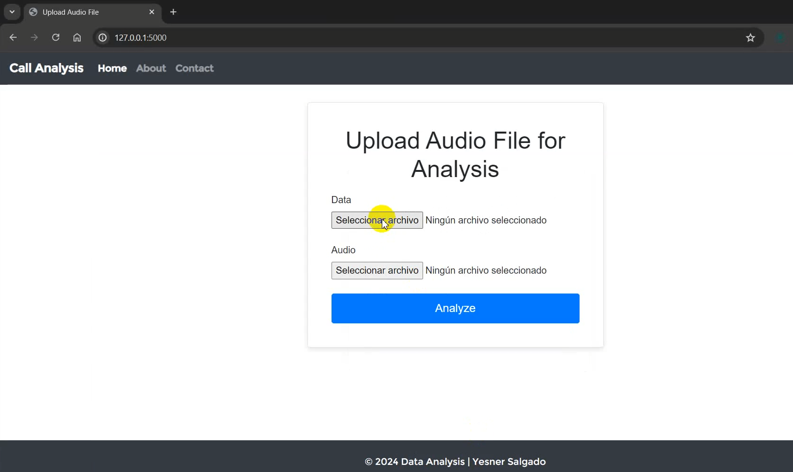
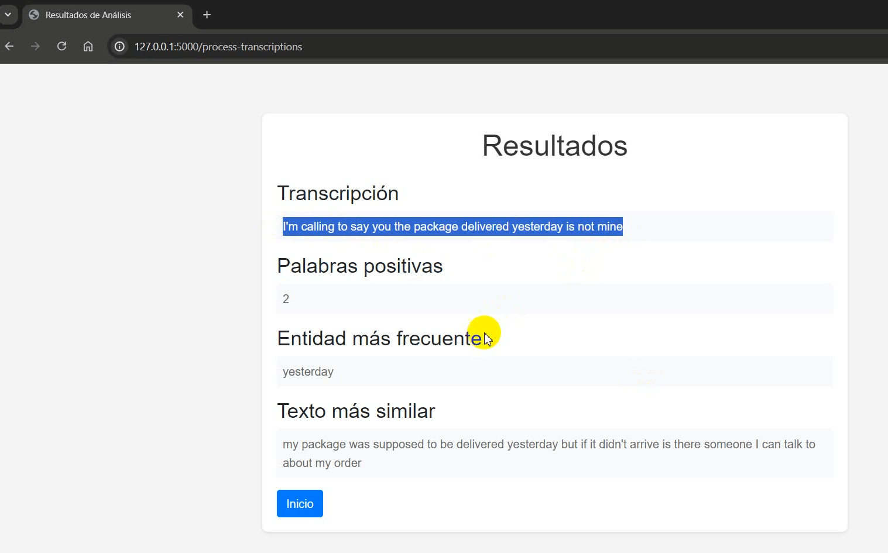

# Analisis-de-sentimiento-Flask

## Python-Flask

Este proyecto fue desarrollado con Flask, y lo que principalmente hace es:

Usar el poder de `SpeechRecognition`, `Pydub` y `spaCy`, tres paquetes de código abierto que forman la columna vertebral de su solución. Tus objetivos son:

- Transcribir una llamada de audio de un cliente de muestra, almacenada en `Test02.wav`, para mostrar el poder de la tecnología de reconocimiento de voz de código abierto.
- Analizar opiniones, identificar entidades con nombres comunes y mejore la experiencia del usuario buscando las llamadas de clientes más similares en función de una consulta determinada de un subconjunto de sus datos de llamadas pretranscritos, almacenados en `calls.csv`.

Este proyecto es una oportunidad para desbloquear el potencial del aprendizaje automático para revolucionar la atención al cliente. 





### Clonar y Ejecutar Proyecto

Sigue los siguientes pasos para clonar y ejecutar este proyecto en tu entorno local.

### Requisitos previos

1. [Python](https://www.python.org/) - Asegúrate de tener Python instalado, que incluye pip para administrar las dependencias del proyecto.

3. [Git](https://git-scm.com/) - Necesitarás Git para clonar el repositorio.

## Pasos para clonar y ejecutar el proyecto

1. **Clonar el repositorio:**
   Abre tu terminal (o línea de comandos) y ejecuta el siguiente comando para clonar el proyecto desde GitHub:

   ```bash data-copyable
    git clone git@github.com:Yesner/Analisis-de-sentimiento-Flask.git

2. **Prepara tu entorno virtual** 
  
   ```python data-copyable
    python -m venv venv

   
3. **Instalar dependencias:**
    
    ```bash data-copyable
   !pip install nltk
   !pip install spacy


4. **Ejecutar el proyecto:**

    ```bash data-copyable
    py app.py

5. **Resultado:**



<video controls src="Result.mp4" title="Result"></video>

